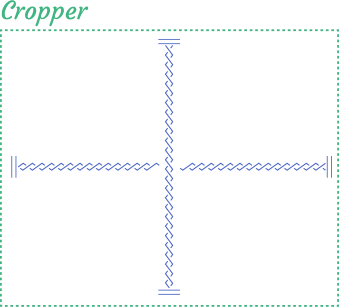

# Under The Hood

## Basic methods

### Refresh image

The image is refreshed on change the `src` prop and on the cropper's mount.

::: warning Notice!
The internal process of `refresh` method is described below.
:::

1. First of all, stretcher is initialized. By default `initStretcher` method tries to
fit to external container image completely by defining to stretcher element its width and height.

2. Cropper waits rerender to await the changing of external container size.

3. After rerender, the cropper determines the boundaries size by calling `boundaries` method and getting its result to 
set `boundariesSize` value.

4. After boundaries is determined, the visible area coordinates is calculated by method `defaultVisibleArea`. 
The cropper always checks that visible area ratio is equal to the boundaries aspect ratio, if it's not equal,
cropper recalculates visible area height to corresponding aspect ratio of the boundaries.

5. After calculating boundaries and visible area `updateVisibleArea` methods is called. This method tries do adapt
calculated visible area on previous step to the previous `visibleArea` value, current `coordinates` and `boundariesSize`.

6. Cropper checks that coordinates fits inside visible area. If it's not cropper adapts coordinates to fit to
visible area. It may break minimum width and minimum height restrictions but it always preserve aspect ratio restrictions.

7. The internal values `visibleArea` and `coordinates` are updated.

### Reset coordinates

The coordinates resets on each successful image change.

::: warning Notice!
The internal process of `resetCoordinates` method is described below.
:::

1. Calculate default size with `defaultSize` method. It returns the object with `width` and `height` fields.
 
2. Calculate default position with `defaultPosition`. It returns the object with `left` and `top` fields.

3. Form default transforms array `[{ width, height }, { left, top}]` where `width`, `height`, `left` and `top` are fields calculated before.

4. If there was delayed transforms, i.e. transforms that was applied after change image but before it was loaded, append them to the transforms array. 
It's needed to give the possibility 

5. Apply transforms.

### Apply transforms

It's the main way to update `coordinates`. 

It is used every time when need to independently change coordinates (`setCoordinates`, `resetCoordinates`) or adapt current coordinates to props changes (`minWidth`, `maxWidth`, `minHeight`, `maxHeight`).

::: warning Notice!
The internal process of `applyTransforms` method is described below. You shouldn't call this method himself.
:::

This method has two parameters `transforms` and `autoZoom`. 
The first parameter is an object of coordinates or array with one objects. 
The second parameter indicates should be autozoom (i.e. translating and resizing visible area to fit new coordinates) is used or not.

For each a transform:

1. If there is `width` or `height` field in the transform generate the box by `approximiatedSize` algorithm that creates
the box with width and height similar to given one with respect to the limitations (aspect ratio, maximum and minimum values of one). 
After that cropper tries to return the box to its previous coordinates with respect to limitations returns by `coordinatesLimits`, but not 
visible area (i.e. stencil can leave the current visible area). 

2. If there is `left` or `top` field in the transform cropper moves box to given coordinates. Yet again, with respect to `coordinatesLimits`, but not `visibleArea`.

After all transformations, if `autoZoom` parameter is set, apply autozoom algorithm to transform visible area in such way that coordinates
fits into it.

At the end, this method calls `onChangeCoordinates` method, that updates internal coordinates and emit corresponding event.

## What's happens when?

## Resize window

1. Refresh image by `refresh` method.

2. Update stencil coordinates.

## Change image

The following cycle runs when image is changed.

1. If `checkOrientation` is true cropper send request to get the binary representation of image. 
If the image was received and it has `jpg` image type, the image orientation is parsed and used 
in the future.

2. After image was loaded `refreshImage` is called and image is refreshed as written above.

3. Reset coordinates.

4. Update stencil coordinates.
